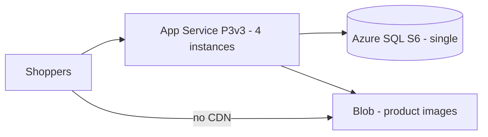
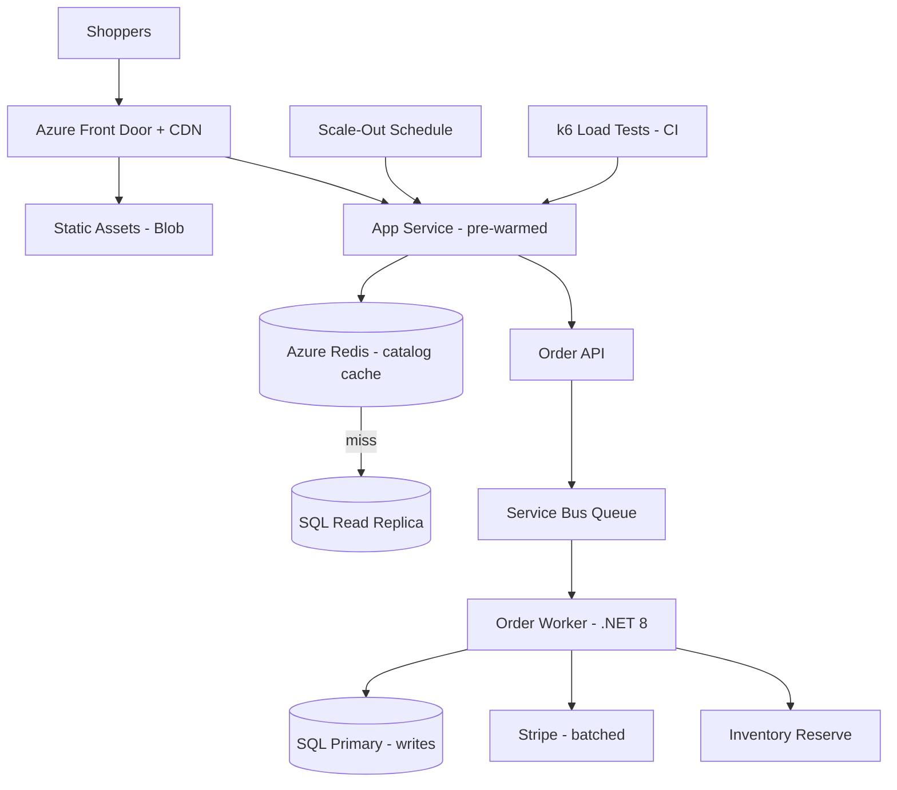

# Case Study: Retail Black Friday Peak Scale

| Attribute | Value |
|-----------|-------|
| **Industry** | E-commerce (national retailer) |
| **Scale** | 500 RPS normal, 15K RPS Black Friday peak |
| **Week** | 44 |
| **Difficulty** | Advanced |

## Business Context

A national retailer runs a .NET 8 e-commerce monolith on Azure App Service. Normal traffic is 500 requests/second. Last Black Friday peaked at 15K RPS — a 30× spike. The site suffered a 4-hour outage; estimated revenue loss: $8M. The CTO wants an architecture that handles peak without year-round over-provisioning.

You have 14 weeks until the next Black Friday. Design for scale, cost consciousness, and a pre-warm strategy.

## Current State



**Current implementation issues (from post-incident review):**
- No CDN — product images served from App Service origin
- No cache layer — every product page hits SQL
- Synchronous order processing in request path (800ms p99 at peak)
- App Service auto-scale rule: CPU > 70% — too slow; instances added after overload
- SQL S6 hit DTU ceiling at 4K RPS; connection pool exhaustion
- No load test in CI; last k6 test was 6 months ago at 2K RPS

## Requirements

### Functional
- Product catalog browse and search under peak load
- Checkout and order placement (async confirmation acceptable)
- Inventory reservation must not oversell
- Admin product updates propagate to cache within 5 minutes

### Non-Functional
| NFR | Target |
|-----|--------|
| Throughput | 15,000 RPS peak |
| Latency (p99) | < 500ms (browse); < 2s (checkout submit) |
| Availability | 99.95% during Black Friday weekend |
| RTO | 30 minutes |
| RPO | 5 minutes |
| Year-round cost | ≤ $12K/month (not peak provisioned 365 days) |

## Constraints

- Team: 12 .NET developers, 2 platform engineers
- 14-week timeline to Black Friday
- Cannot rewrite monolith — incremental improvements only
- Payment gateway (Stripe) rate limits: 100 req/sec per merchant key — need aggregation
- Marketing announces exact sale start time (predictable spike)
- Budget: +$25K one-time for Black Friday burst; +$3K/month steady state

## Your Task

1. Identify the top 3 bottlenecks from last year's outage
2. Design CDN, caching, and SQL scaling strategy
3. Propose queue-based order processing architecture
4. Define pre-warm and auto-scale strategy for known peak
5. Deliver k6 load test plan with pass criteria

> **Attempt your solution before reading the reference below.**

---

## Reference Solution

### Top 3 Issues

1. **No caching/CDN** — SQL and origin saturated at 30× traffic multiplier
2. **Synchronous order path** — long requests held connections; thread pool starvation
3. **Reactive auto-scale** — CPU-based scaling lagged behind traffic spike

### Revised Architecture



### Key Decisions

| Decision | Choice | Rationale |
|----------|--------|-----------|
| Static assets | Front Door + CDN | Offload 60% RPS from origin |
| Catalog cache | Redis with 5-min TTL + pub/sub invalidation | 95% cache hit at peak; SQL read replica for misses |
| SQL | Elastic pool + read replica for browse | Writes to primary; browse scales horizontally |
| Order processing | Async via Service Bus | Checkout returns 202 in < 200ms; worker processes |
| Pre-warm | Scheduled scale to 20 instances T-30 min | Predictable sale start; avoid reactive lag |
| Load testing | k6 in CI: 2K baseline, 15K pre-BF gate | Block deploy if p99 > 500ms at 15K RPS |

### Pre-Warm Schedule

| Time | Action |
|------|--------|
| T-7 days | Run 15K RPS k6 soak test in staging |
| T-1 day | Scale SQL elastic pool to peak tier |
| T-30 min | App Service → 20 instances (scheduled rule) |
| T-0 | Sale start; on-call war room |
| T+4 hours | Scale down to 8 instances |

### k6 Load Test Scenarios

```javascript
// Scenario: browse 80%, checkout 15%, search 5%
export const options = {
  stages: [
    { duration: '5m', target: 15000 },
    { duration: '30m', target: 15000 },
    { duration: '5m', target: 0 },
  ],
  thresholds: { http_req_duration: ['p(99)<500'] },
};
```

### Expected Outcome

- Peak capacity: 4K RPS (failed) → 18K RPS tested
- p99 browse latency: timeout → 380ms at 15K RPS
- Black Friday cost: +$8K burst (scale up/down) vs +$40K/year if always provisioned
- Revenue risk: $8M loss mitigated

## Discussion Questions

1. When would you split the monolith vs add cache/CDN only?
2. How do you prevent Redis cache stampede on hot product launch?
3. Is 202 async checkout acceptable UX for Black Friday shoppers?

## Interview Story Angle

**STAR prompt:** "Tell me about preparing a system for a known traffic spike."

Use this case study: emphasize predictable peak pre-warm, cache-first architecture, async order path, and load test as deploy gate.
