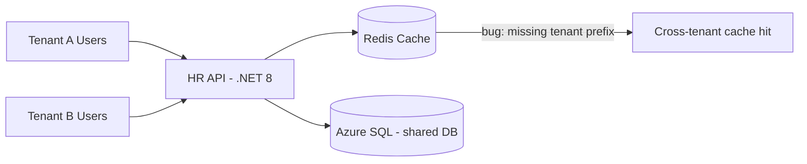
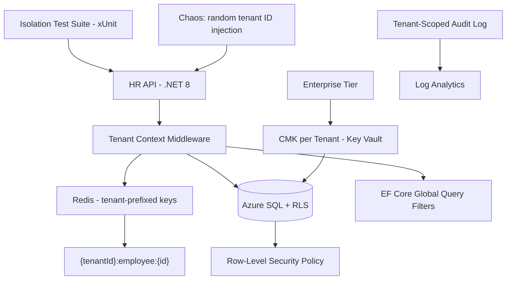

# Case Study: SaaS Multi-Tenant Isolation Failure

| Attribute | Value |
|-----------|-------|
| **Industry** | B2B HR SaaS |
| **Scale** | 800 tenants, 3 Fortune 50 with dedicated compliance |
| **Week** | 44 |
| **Difficulty** | Expert |

## Business Context

A B2B HR SaaS platform serves 800 tenants on shared Azure infrastructure. A Fortune 50 customer (Tenant A) received an API response containing an employee name from Tenant B — a cache key namespace bug. The customer is filing an SEC disclosure; contract termination is on the table.

You are the architect tasked with root cause analysis, defense-in-depth isolation fix, and customer communication plan.

## Current State



**Current implementation issues (from 5-whys RCA):**
- Cache keys used `employee:{id}` without `tenantId` prefix
- SQL queries rely on application-layer `WHERE TenantId = @tid` — no Row-Level Security
- Integration tests mock cache; no multi-tenant isolation test suite
- 3 enterprise tenants require CMK (Customer-Managed Keys) — not implemented
- No chaos or pen test for tenant boundary violations
- Incident response took 72 hours to identify root cause (insufficient audit logging)

## Requirements

### Functional
- Hard tenant isolation for all API responses (zero cross-tenant data leakage)
- Support shared-database model for standard tier; silo option for enterprise
- Per-tenant encryption keys for Fortune 50 enterprise tier
- Tenant-scoped audit log for compliance customers

### Non-Functional
| NFR | Target |
|-----|--------|
| Availability | 99.95% |
| Latency (p99) | < 150ms (cache hit) |
| Isolation | Zero cross-tenant leakage — verified by automated tests |
| RPO | 15 minutes |
| RTO | 1 hour |
| Pen test | Annual third-party + quarterly internal chaos |

## Constraints

- Team: 8 .NET developers, 2 platform engineers
- Cannot migrate all 800 tenants to silo model (cost prohibitive)
- Fix must deploy within 2 weeks for at-risk enterprise accounts
- SEC customer requires written RCA and remediation plan within 10 business days
- Redis Enterprise already provisioned — prefer fix over replace
- EF Core global query filters exist but were bypassed in one repository

## Your Task

1. Complete 5-whys root cause analysis for the cache key bug
2. Design defense-in-depth tenant isolation (cache, SQL, API)
3. ADR: per-tenant CMK for enterprise tier
4. Define pen-test and chaos testing strategy for isolation
5. Outline customer communication plan for SEC filing customer

> **Attempt your solution before reading the reference below.**

---

## Reference Solution

### Top 3 Issues

1. **Cache key without tenant namespace** — direct cause of cross-tenant data return
2. **Application-only tenant filter** — bypassed in one code path; no database enforcement
3. **No isolation test suite** — regression shipped to production undetected

### Root Cause (5 Whys)

1. **Why** did Tenant A see Tenant B data? → API returned cached employee from wrong tenant
2. **Why** wrong cache entry? → Cache key `employee:12345` collided across tenants
3. **Why** no tenant prefix? → Cache helper written before multi-tenant refactor
4. **Why** undetected? → No integration test with two tenants hitting same employee ID
5. **Why** no test? → Test suite uses single-tenant in-memory cache mock

### Revised Architecture



### Key Decisions

| Decision | Choice | Rationale |
|----------|--------|-----------|
| Cache keys | Mandatory `{tenantId}:{entity}:{id}` via wrapper | Single `ICacheService` — cannot bypass |
| SQL isolation | Row-Level Security + EF global filters | Defense in depth; RLS blocks bypass |
| Enterprise tier | Per-tenant CMK in Key Vault | SEC customer requirement; encryption boundary |
| Testing | Multi-tenant integration tests in CI | Two tenants, same entity IDs, assert isolation |
| Chaos | Quarterly script: random tenant context swap | Proves middleware + RLS under adversarial conditions |
| Repository bypass | Removed; all data access via `ITenantDbContext` | Code review gate |

### Cache Wrapper

```csharp
public class TenantCacheService(ITenantContext tenant, IDistributedCache cache)
{
    private string Key(string entity, string id)
        => $"{tenant.TenantId}:{entity}:{id}";
    // All cache ops go through Key() — no raw keys allowed
}
```

### Customer Communication Plan

| Day | Action |
|-----|--------|
| 1 | Acknowledge incident; engage customer CISO; preserve audit logs |
| 3 | Preliminary RCA shared under NDA |
| 7 | Remediation deployed to production; pen test scheduled |
| 10 | Final RCA + CMK ADR for enterprise tier; executive call |

### Expected Outcome

- Cross-tenant leakage: eliminated via cache wrapper + RLS (verified by 200 isolation tests)
- Enterprise retention: SEC customer renews with CMK addendum
- Chaos: quarterly isolation drill added to SRE calendar
- Audit: tenant-scoped logs satisfy customer SOC 2 evidence request

## Discussion Questions

1. Shared DB vs silo per tenant — where is the cost/isolation crossover?
2. Can RLS alone be sufficient without application-layer filters?
3. How do you prioritize which 3 Fortune 50 tenants get CMK first?

## Interview Story Angle

**STAR prompt:** "Tell me about a serious data isolation incident and your response."

Use this case study: emphasize defense in depth (not single fix), 5-whys to systemic test gap, and customer trust recovery via transparency and CMK.
