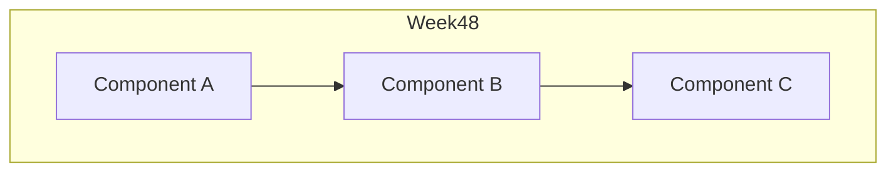

# Week 48 Diagrams

## Whiteboard Mock 1

```mermaid
flowchart TB
    subgraph Week48
        A[Component A] --> B[Component B]
        B --> C[Component C]
    end
```

Add C4 Context and Container diagrams during study week.

---

[← Back to Week 48](../README.md)
