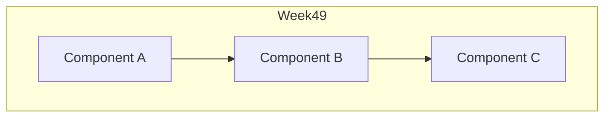

# Week 49 Diagrams

## Whiteboard Mock 2

```mermaid
flowchart TB
    subgraph Week49
        A[Component A] --> B[Component B]
        B --> C[Component C]
    end
```

Add C4 Context and Container diagrams during study week.

---

[← Back to Week 49](../README.md)
